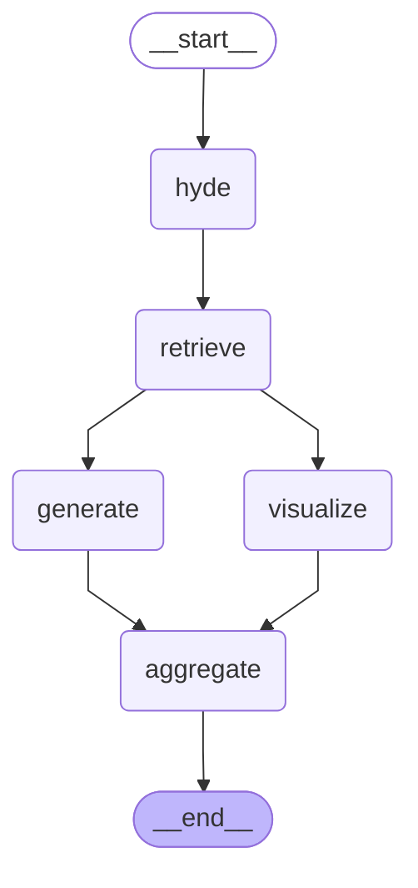

# RAG Graph Visualization

## 노드 설명

| 노드 | 역할 |
|------|------|
| **hyde** | HyDE - 가상 문서 생성 |
| **retrieve** | 앙상블 검색 + Parent 확장 |
| **generate** | LLM 답변 생성 |
| **visualize** | 근거 문서 시각화 (TF-IDF, 히트맵 등) |
| **aggregate** | 결과 집계 |

## 흐름

1. `hyde`: 사용자 쿼리로부터 가상 문서 생성
2. `retrieve`: 앙상블 검색 (BM25 + Vector) → Parent 문서 확장
3. **병렬 처리**:
   - `generate`: LLM으로 답변 생성
   - `visualize`: 검색된 문서 분석 및 시각화 생성
4. `aggregate`: 답변 + 시각화 결과 통합
